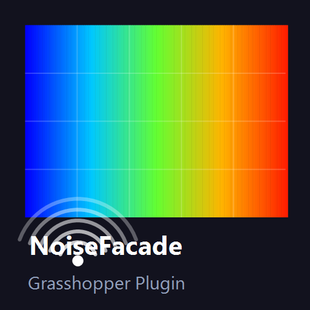

# NoiseFacade GH



A Grasshopper plugin for Rhino 8 that paints a live acoustic noise heat-map onto any architectural geometry — facade panels, organic surfaces, Breps, SubDs.

---

## What it does

Drop a geometry and one or more noise sources onto the canvas. NoiseFacade computes the sound pressure level at every face using inverse-square law + Lambert cosine incidence and paints the result directly in the Rhino viewport — **red** where noise is loudest, **blue** where it's quietest.


---

## Acoustic model

```
L  =  L_source  −  20·log₁₀(d)  −  11  +  10·log₁₀(cos θ + 0.01)
```

| Symbol | Meaning |
|---|---|
| `L_source` | Sound power level at source (dB SPL) |
| `d` | Distance from source to face centroid (m), clamped ≥ 0.1 m |
| `θ` | Angle of incidence — angle between face normal and direction to source |

Multiple sources are combined by **energy summation**:

```
L_total  =  10·log₁₀( Σ 10^(Lᵢ/10) )
```

---

## Installation

### From release (recommended)
1. Download `NoiseFacadeGH.gha` from [Releases](../../releases)
2. Copy it to `%APPDATA%\Grasshopper\Libraries\`
3. Restart Rhino

### From source
Requirements: .NET SDK, Rhino 8

```bat
git clone https://github.com/YOUR_USERNAME/NoiseFacadeGH
cd NoiseFacadeGH
build.bat
```

`build.bat` compiles and copies the `.gha` automatically.

---

## Usage

| Input | Nickname | Description |
|---|---|---|
| Geometry | G | Mesh, Surface, Brep, SubD, or Extrusion |
| Sources | S | List of noise source points |
| dB Levels | dB | Sound level at each source (dB SPL) |
| Quality | Q | Mesh resolution 0 (fast) – 3 (fine). Default 1 |
| Min dB | Min | Pin the lower bound of the colour scale (optional) |
| Max dB | Max | Pin the upper bound of the colour scale (optional) |

| Output | Nickname | Description |
|---|---|---|
| Mesh | M | Vertex-coloured mesh |
| Face dB | dB | Per-face dB values (list) |
| Min dB | Min | Actual scale minimum |
| Max dB | Max | Actual scale maximum |

**Min / Max inputs** — leave disconnected for auto-scaling. Connect them when you need a fixed reference scale (e.g. comparing two facade designs, or showing results relative to a regulatory limit).

---

## Colour gradient

| Colour | Meaning |
|---|---|
| 🔵 Blue | Quietest (scale minimum) |
| 🩵 Cyan | 25 % |
| 🟡 Yellow | 50 % |
| 🟠 Orange | 75 % |
| 🔴 Red | Loudest (scale maximum) |

---

## Supported geometry types

| Type | Conversion |
|---|---|
| `Mesh` | Used directly |
| `Surface` | → Brep → mesh |
| `Brep` | → mesh |
| `Extrusion` | → Brep → mesh |
| `SubD` | → Brep → mesh (falls back to limit-surface mesh) |

---

## Requirements

- Rhino 8 (uses RhinoCommon 8.x and Grasshopper 1.x)
- .NET Framework 4.8

---

## License

MIT — see [LICENSE](LICENSE)
